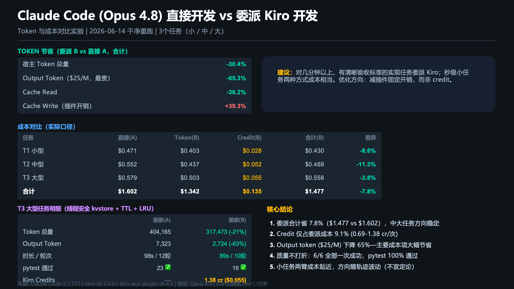

# kiro-acp-plugin

English | [简体中文](README.zh-CN.md)

Claude Code plugin: delegate tasks to the local [kiro-cli](https://kiro.dev)
agent as a multi-turn sub-agent. One Node process bridges MCP (toward Claude
Code) and ACP (toward `kiro-cli acp`).

The bridge itself is a plain stdio MCP server, so it also works in other MCP
hosts — [OpenAI Codex CLI setup below](#use-with-openai-codex-cli).

## Why delegate?

Delegating implementation to kiro moves the expensive part of coding — the
many-turn read/edit/test/fix loop — off the host model and onto kiro's
credit-billed agent. The host keeps only the cheap work; *how* cheap depends on
whether it still verifies kiro's output afterward. Two controlled A/B experiments
(same Opus 4.8 on both sides, three coding tasks small→large, an independent
framework `pytest` as the quality gate) bracket the range:

- **Delegate-then-verify** — the host reads the created files and re-runs
  `pytest`, re-delegating on failure (the pattern the bundled skill teaches):
  **~30% fewer host tokens, ~65% fewer host *output* tokens, ~8% cheaper overall**
  ($1.48 vs $1.60).
  [report](docs/experiments/2026-06-12-token-credit-cost-experiment.md)
- **Delegate-and-trust** — the host fires one delegation, trusts kiro's own test
  run, and never reads files or runs `pytest` itself:
  **~71% fewer host tokens, ~87% fewer host output tokens, ~48% cheaper overall**
  ($1.05 vs $2.03). The verification round-trips *were* most of the host cost, so
  dropping them roughly halves it — but this also removes the host's safety net:
  correctness then rests entirely on kiro's self-test.
  [report](docs/experiments/2026-06-16-token-credit-cost-noverify-experiment.md)

Output (the priciest line item at $25/M) is what delegation pushes onto kiro; the
host bill that remains converts into kiro credits ($0.04 each), only **~9–19%** of
the delegated total. **No quality regression in either run** — every arm passed
the independent `pytest`, and the delegated arms produced at least the required
test coverage. The no-verify quality held *because* that independent gate
confirmed it; real usage usually has no such external gate, so prefer
delegate-then-verify unless you have CI or another check downstream.



So the plugin's value isn't "always cheaper" — it's that for non-trivial,
well-specified implementation work it shifts spend from your Opus token pool to
kiro's credit pool and cuts the priciest output tokens. Verification is the knob:
keep it for a host-side safety net (~8% cheaper), or drop it to roughly halve cost
when an external gate has your back (~48% cheaper). Numbers are n=1 per cell on
minute-scale tasks; see the reports' limitations.

> **v0.4.4 — context-overhead pass.** A follow-up measured the plugin's true
> always-in-context cost deterministically: ~534 tokens (3 MCP tool defs + skill
> & agent descriptions), trimmed to **~437 tokens (−18%)** by moving operational
> detail out of the registry descriptions. This also corrected an earlier
> misread in the report: the cache-write difference between arms was **not**
> "plugin loading" (the footprint is tiny, and both arms load the plugin since
> it's globally installed) — it's the delegation round-trips, longer prompt, and
> cache-TTL rewrite timing. The optimization is real but below the experiment's
> run-to-run noise floor, so it doesn't move the cost numbers above (report §10).

## Architecture


Claude Code calls the plugin's MCP tools over stdio JSON-RPC. The bundled
server is simultaneously an **MCP server** (toward Claude Code) and an **ACP
client** (toward a lazily-spawned, long-lived `kiro-cli acp` child). It maps
`kiro_prompt`/`kiro_cancel`/`kiro_list_sessions` onto ACP `session/new` +
`session/prompt` + `session/cancel`, multiplexes many sessions over one kiro
process, and relays ACP `session/update` notifications back as MCP progress.

## Session model (multi-turn memory)

Delegations are stateful: you can keep talking to the same kiro session across
many `kiro_prompt` calls, and kiro remembers the earlier turns — no need to
restate context. The memory lives in two layers:

- **The conversation history lives in the kiro process.** The bridge spawns one
  long-lived `kiro-cli acp` child (lazily, on first delegation). `session/new`
  returns a `sessionId`, and kiro holds that session's full transcript inside
  its own process. The bridge stores **no** conversation text.
- **The bridge keeps only a lightweight registry** — `{id, cwd, status,
  lastActivityAt}` per session, with status `idle | running | dead`. Its job is
  lifecycle and concurrency, not memory.

How a multi-turn thread is stitched together: the first `kiro_prompt` (no
`session_id`) creates a session and returns its `session_id`; every later call
passes that same `session_id` back, so the bridge routes the prompt to the same
kiro transcript. One kiro process multiplexes many sessions concurrently
(notifications are routed by `sessionId`), which is what lets `kiro-sub-agent`
fan out parallel delegations without crosstalk.

Rules that keep multi-turn correct:

- `idle` → reusable: pass its `session_id` to continue the thread.
- `running` → a prompt is in flight; a second prompt on it is rejected (wait,
  `kiro_cancel`, or start a new session).
- `dead` → the kiro process exited since the session was created, so its memory
  is gone; start a new session (omit `session_id`) and restate context.
- A prompt **timeout** cancels the turn but keeps the session usable (back to
  `idle`); only a kiro **crash** marks sessions `dead`.

Verified end-to-end: across three calls reusing one `session_id`, kiro recalled
a fact from turn 1 and a value from its own turn-2 answer (`4273` → asked to add
1000 → `5273`), with the session ending `idle` and reusable.

## Requirements

- Node.js >= 20
- `kiro-cli` >= 2.6.0 on PATH, logged in (`kiro-cli login`)

## Install (from the marketplace)

    claude plugin marketplace add xiehust/kiro-acp-plugin
    claude plugin install kiro-acp-plugin@kiro-acp-plugin

Or inside a Claude Code session:

    /plugin marketplace add xiehust/kiro-acp-plugin
    /plugin install kiro-acp-plugin@kiro-acp-plugin

No build step needed — `server/dist` ships prebuilt in the repo.

## Install (local development)

    cd server && npm install && npm run build
    claude --plugin-dir /path/to/kiro-acp-plugin

Then in Claude Code: `/mcp` should list a `kiro` server with 3 tools.

## Use with OpenAI Codex CLI

The same bridge works in Codex; only the packaging differs (Codex has no
Claude-style plugins — the `/kiro` command and `kiro-sub-agent` agent type
are Claude Code-only, but the skill installs as a standard
[agent skill](https://developers.openai.com/codex/skills/)).

    git clone https://github.com/xiehust/kiro-acp-plugin
    cd kiro-acp-plugin
    ./codex/install.sh

The script appends `[mcp_servers.kiro]` to `~/.codex/config.toml` and
symlinks `skills/delegating-to-kiro` into `~/.agents/skills` (Codex's global
skills directory). For manual setup, see
[codex/config.example.toml](codex/config.example.toml).

The one setting that matters: **`tool_timeout_sec`**. Codex kills MCP tool
calls after 60s by default, but `kiro_prompt` blocks until kiro finishes
(up to 30 min by default). The installer sets it to 1860 so the bridge's own
graceful timeout (cancel + partial output, session stays usable) wins.

Verify inside Codex: `/mcp` lists `kiro` with 3 tools, `/skills` lists
`delegating-to-kiro`. Then either ask Codex to delegate ("have kiro fix the
failing test in ...") or invoke the skill explicitly with
`$delegating-to-kiro <task>`. Since the server is registered globally, pass
`cwd` (absolute path) in `kiro_prompt` when the target project differs from
the directory Codex was started in.

## Tools

- `kiro_prompt(prompt, session_id?, cwd?, model?, agent?, effort?)` — delegate
  a task; blocks until kiro finishes; returns reply + session_id + activity.
- `kiro_cancel(session_id)` — stop a running delegation.
- `kiro_list_sessions()` — show sessions (idle | running | dead).

`/kiro <task>` is a shortcut command; the `delegating-to-kiro` skill teaches
Claude when to delegate and to always verify results.

### kiro-sub-agent

The plugin also ships a `kiro-sub-agent` agent type: a coordinator that wraps
the whole delegate-then-verify loop in an isolated context. Use it for
long-running tasks or parallel fan-out (dispatch several at once — the bridge
multiplexes sessions over one kiro process). kiro's verbose output and the
`git diff`/test verification stay inside the sub-agent; your main
conversation gets back only a compact verdict, the changed files, the
verification evidence, and the `session_id` for follow-ups.

> Have the kiro-sub-agent build the CSV exporter in src/export/ while we
> keep working on the API.

## Usage example

The simplest path — just ask Claude, and the skill decides to delegate:

> **You:** Have kiro add input validation to `src/api/users.ts` — reject
> requests with a missing or non-string `email`, return 400. Then verify it.

Claude calls `kiro_prompt` with an enriched task, kiro does the work on your
filesystem while progress streams in, and Claude verifies the diff before
reporting back:

```
> kiro_prompt(prompt: "In src/api/users.ts add validation to the create-user
                       handler: if `email` is missing or not a string, respond
                       400 with {error: 'email required'}. Keep existing style.")
  … [progress] working on src/api/users.ts
  … [tool] edit src/api/users.ts (completed)
  ← session_id: 7f3a… | kiro added the guard and a 400 branch | 1 tool call

Claude then runs `git diff` and the test suite itself, then tells you what
changed and that it verified the behavior.
```

Follow up in the **same** kiro session (no need to restate context):

> **You:** Now have kiro add a unit test for that 400 case.

Claude reuses the returned `session_id`, so kiro already remembers the change.

Or trigger delegation explicitly with the command:

```
/kiro refactor the retry logic in src/net/client.ts to use exponential backoff
```

Manage in-flight work:

- "list the kiro sessions" → `kiro_list_sessions()`
- "cancel that kiro task" → `kiro_cancel(session_id)`

## Configuration (env, set in .mcp.json or your shell)

- `KIRO_MCP_MODEL` — model for the first kiro session, passed as `--model` at
  spawn. The plugin defaults this to `claude-opus-4.8` (via `.mcp.json`;
  export `KIRO_MCP_MODEL` in your shell to override, or set it to `auto` to
  let kiro choose). An explicit `model` on the first `kiro_prompt` call still
  wins. Valid ids: `kiro-cli chat --list-models`.
- `KIRO_MCP_TIMEOUT_MS` — per-prompt timeout (default 1800000 = 30 min)
- `KIRO_MCP_TRUST_TOOLS` — comma list for `--trust-tools=...` (default: `--trust-all-tools`)
- `KIRO_MCP_BIN` — kiro binary path (default: `kiro-cli` on PATH)

## Development

    cd server
    npm test                       # unit/integration vs scripted fake agent
    KIRO_MCP_E2E=1 npm test        # plus real kiro-cli smoke test

- Architecture spec: docs/superpowers/specs/2026-06-12-kiro-acp-mcp-plugin-design.md
- Implementation plan: docs/superpowers/plans/2026-06-12-kiro-acp-mcp-plugin.md
