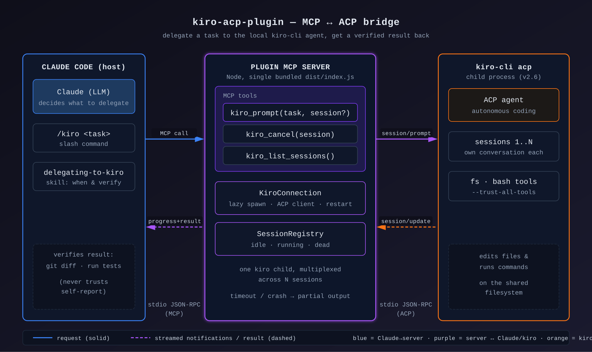

# kiro-acp-plugin

[English](README.md) | 简体中文

Claude Code 插件:把任务委派给本机的 [kiro-cli](https://kiro.dev) agent,
作为可多轮跟进的子代理(sub-agent)。一个 Node 进程桥接 MCP(面向 Claude
Code)与 ACP(面向 `kiro-cli acp`)。

桥本身是纯 stdio MCP server,因此也能在其他 MCP host 中使用 ——
[OpenAI Codex CLI 配置见下文](#在-openai-codex-cli-中使用)。

## 架构



Claude Code 通过 stdio JSON-RPC 调用插件的 MCP 工具。内置的 server 同时是
**MCP server**(面向 Claude Code)和 **ACP client**(面向懒加载、常驻的
`kiro-cli acp` 子进程)。它把 `kiro_prompt`/`kiro_cancel`/`kiro_list_sessions`
映射到 ACP 的 `session/new` + `session/prompt` + `session/cancel`,在一个
kiro 进程上复用多个会话,并把 ACP `session/update` 通知以 MCP 进度通知的
形式转发回来。

## 环境要求

- Node.js >= 20
- `kiro-cli` >= 2.6.0 已在 PATH 上,且已登录(`kiro-cli login`)

## 安装(从 marketplace)

    claude plugin marketplace add xiehust/kiro-acp-plugin
    claude plugin install kiro-acp-plugin@kiro-acp-plugin

或在 Claude Code 会话内:

    /plugin marketplace add xiehust/kiro-acp-plugin
    /plugin install kiro-acp-plugin@kiro-acp-plugin

无需构建 —— 仓库中已带有预构建的 `server/dist`。

## 安装(本地开发)

    cd server && npm install && npm run build
    claude --plugin-dir /path/to/kiro-acp-plugin

然后在 Claude Code 中:`/mcp` 应列出一个带 3 个工具的 `kiro` server。

## 在 OpenAI Codex CLI 中使用

同一个桥也能在 Codex 中工作,差别只在打包方式(Codex 没有 Claude 式的插件
体系 —— `/kiro` 命令和 `kiro-sub-agent` agent 类型是 Claude Code 专属,但
skill 可以作为标准
[agent skill](https://developers.openai.com/codex/skills/) 安装)。

    git clone https://github.com/xiehust/kiro-acp-plugin
    cd kiro-acp-plugin
    ./codex/install.sh

脚本会把 `[mcp_servers.kiro]` 追加到 `~/.codex/config.toml`,并把
`skills/delegating-to-kiro` 软链接到 `~/.agents/skills`(Codex 的全局
skills 目录)。手动配置参见
[codex/config.example.toml](codex/config.example.toml)。

最关键的一项设置:**`tool_timeout_sec`**。Codex 默认在 60 秒后强制终止
MCP 工具调用,而 `kiro_prompt` 会一直阻塞到 kiro 完成(默认最长 30 分钟)。
安装脚本把它设为 1860,让桥自身的优雅超时(取消 + 返回部分输出,会话仍
可用)先于 Codex 的强制终止生效。

在 Codex 中验证:`/mcp` 列出带 3 个工具的 `kiro`,`/skills` 列出
`delegating-to-kiro`。然后可以直接让 Codex 委派("让 kiro 修复 ... 里
失败的测试"),或用 `$delegating-to-kiro <任务>` 显式调用 skill。由于
server 是全局注册的,当目标项目与 Codex 启动目录不同时,请在
`kiro_prompt` 中传入 `cwd`(绝对路径)。

## 工具

- `kiro_prompt(prompt, session_id?, cwd?, model?, agent?, effort?)` ——
  委派一个任务;阻塞直到 kiro 完成;返回回复 + session_id + 活动摘要。
- `kiro_cancel(session_id)` —— 停止一个正在运行的委派。
- `kiro_list_sessions()` —— 列出会话(idle | running | dead)。

`/kiro <任务>` 是快捷命令;`delegating-to-kiro` skill 教会 Claude 何时
委派,以及始终要验证结果。

### kiro-sub-agent

插件还提供 `kiro-sub-agent` agent 类型:一个把"委派—验证"完整闭环包在
独立上下文中的协调者。适用于长耗时任务或并行分发(一次派发多个 ——
桥会在一个 kiro 进程上复用多个会话)。kiro 的冗长输出和
`git diff`/测试验证都留在 sub-agent 内部;主对话只拿回精简的结论、
变更文件列表、验证证据,以及用于后续跟进的 `session_id`。

> 让 kiro-sub-agent 在 src/export/ 里实现 CSV 导出器,我们继续做 API。

## 使用示例

最简单的方式 —— 直接告诉 Claude,由 skill 决定委派:

> **你:** 让 kiro 给 `src/api/users.ts` 加输入校验 —— `email` 缺失或不是
> 字符串时拒绝请求,返回 400。然后验证一下。

Claude 会带着补全上下文后的任务调用 `kiro_prompt`,kiro 在你的文件系统上
干活、进度实时流式显示,Claude 在汇报前先验证 diff:

```
> kiro_prompt(prompt: "In src/api/users.ts add validation to the create-user
                       handler: if `email` is missing or not a string, respond
                       400 with {error: 'email required'}. Keep existing style.")
  … [progress] working on src/api/users.ts
  … [tool] edit src/api/users.ts (completed)
  ← session_id: 7f3a… | kiro added the guard and a 400 branch | 1 tool call

随后 Claude 自己运行 `git diff` 和测试套件,再告诉你改了什么、
以及行为已经过它验证。
```

在**同一个** kiro 会话中跟进(无需重述上下文):

> **你:** 现在让 kiro 为那个 400 的情况加一个单元测试。

Claude 会复用返回的 `session_id`,kiro 自己记得之前的改动。

也可以用命令显式触发委派:

```
/kiro 重构 src/net/client.ts 里的重试逻辑,改用指数退避
```

管理进行中的任务:

- "列出 kiro 会话" → `kiro_list_sessions()`
- "取消那个 kiro 任务" → `kiro_cancel(session_id)`

## 配置(环境变量,在 .mcp.json 或 shell 中设置)

- `KIRO_MCP_MODEL` —— 首个 kiro 会话使用的模型,启动时以 `--model` 传入。
  插件默认 `claude-opus-4.8`(通过 `.mcp.json`;在 shell 中 export
  `KIRO_MCP_MODEL` 可覆盖,设为 `auto` 则由 kiro 自选)。首次
  `kiro_prompt` 调用里显式传 `model` 参数优先级更高。可用 id 见:
  `kiro-cli chat --list-models`。
- `KIRO_MCP_TIMEOUT_MS` —— 单次 prompt 超时(默认 1800000 = 30 分钟)
- `KIRO_MCP_TRUST_TOOLS` —— 逗号分隔列表,生成 `--trust-tools=...`(默认:`--trust-all-tools`)
- `KIRO_MCP_BIN` —— kiro 可执行文件路径(默认:PATH 上的 `kiro-cli`)

## 开发

    cd server
    npm test                       # 单元/集成测试,基于脚本化的 fake agent
    KIRO_MCP_E2E=1 npm test        # 额外运行真实 kiro-cli 冒烟测试

- 架构设计文档:docs/superpowers/specs/2026-06-12-kiro-acp-mcp-plugin-design.md
- 实现计划:docs/superpowers/plans/2026-06-12-kiro-acp-mcp-plugin.md
